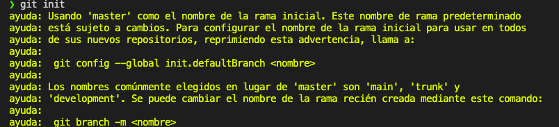
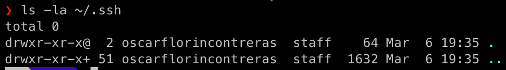
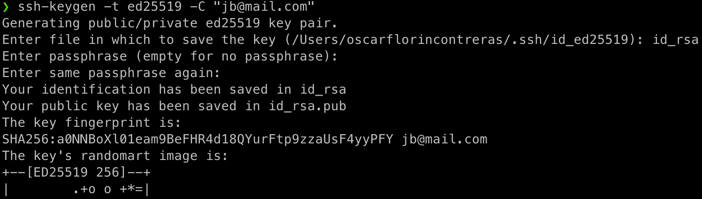
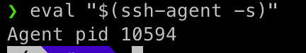
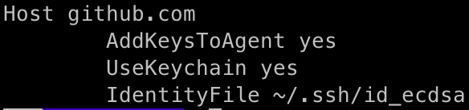
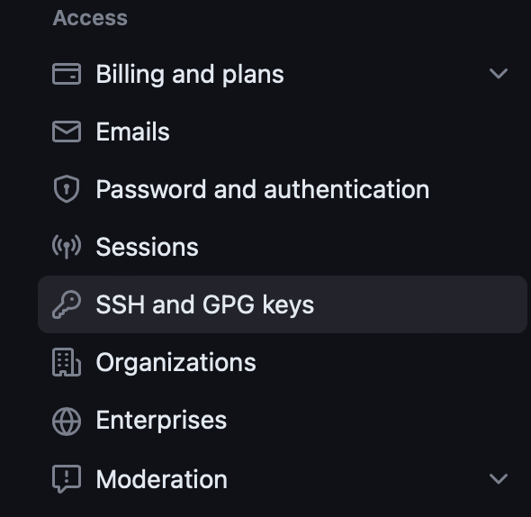
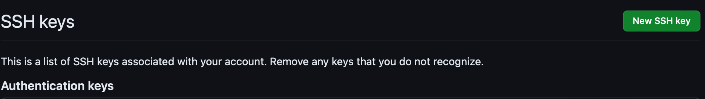
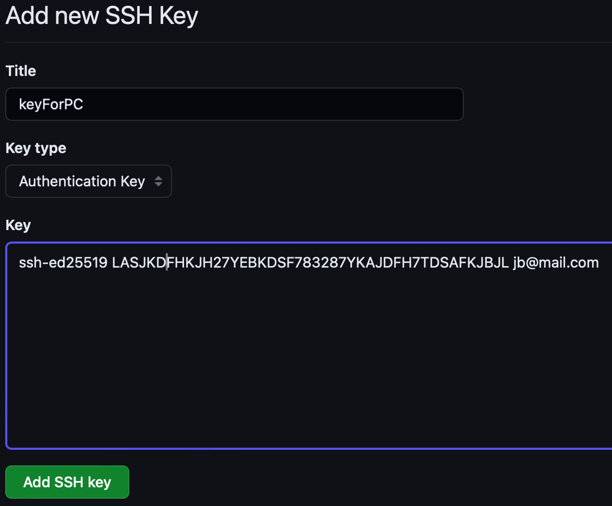
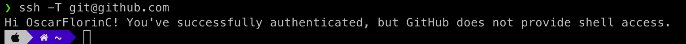

# Configuración de Git

## 1. Configuración inicial git:
### Configuración de usuario y correo, estos datos son globales

#### Comandos:
	git config --global user.name  "JuanLópez"
	git config --global user.email  "jb@mail.com"

## 2. Iniciar el Sistema de control de Versiones (SCDV):

#### Comando:
	git init

###### Salida CLI

## 3. Cambio de nombre de la rama "master" a "main"
### Por buena practica se recomienda cambiar el nombre de la rama

#### Comando:
	git branch -m main

###### Salida CLI

|  | Descripción |
|-----:|---------------|
|  | ***Ejemplo*** |

## 4. Creación de etiquetas para las app's:
### Se sugiere crear etiquetas con cada version de la app, solo se aplica cuando ya se realizó un commit (archivo, aplicación, etc.).

#### Comandos:
	git tag v0.1
	git tag
	git checkout v0.1

## 5. Creación de ramas:
### Las ramas nos permiten desarrollar características, corregir errores, o experimentar con seguridad las ideas nuevas en un área contenida de nuestro repositorio.

#### Comandos:
	git branch developers
	git switch developers

## 6. Git Merge
### Combinar cambios entre las distintas ramas, por ejemplo combinar los cambios de la rama developer a main

#### Comando:
	git merge main

## 7. Eliminar ramas:
### Se elimina una rama, cuando la nueva funcionalidad, error o el desarrollo de una nueva característica ya esta en producción.

#### Comando:
	git branch -d developers

# Configuración de GitHub
## GitHub son repositorios en la nube, un repositorio en la nube nos ayuda, por si un dia nuestro servidor o maquina local falla y la tenemos que reemplazar estos dispositivos, github nos ayuda a recuperar nuestros proyectos.
## También nos ayuda a trabajar con desarrolladores que tienen cuenta en github o con nuestros compañeros de trabajo, independientemente de su ubicación.

## 1. Autenticación SSH:
### SSH (o Secure SHell) es el nombre de un protocolo y del programa que lo implementa cuya principal función es el acceso remoto a un servidor por medio de un canal seguro en el que toda la información está cifrada. Además de la conexión a otros dispositivos, SSH permite copiar datos de forma segura (tanto archivos sueltos como simular sesiones FTP cifradas), gestionar claves RSA para no escribir contraseñas al conectar a los dispositivos y pasar los datos de cualquier otra aplicación por un canal seguro tunelizado mediante SSH y también puede redirigir el tráfico del (Sistema de Ventanas X) para poder ejecutar programas gráficos remotamente.

#### Comandos:
	ls -la ~/.ssh								> Nos muestra las claves SSH que se han creado anteriormente

###### Salida CLI

## b. Generando key pair:
#### Comando:
	ssh-keygen -t ed25519 -C "jb@mail.com"		> Este comando genera el keypair
												> asignar nombre al keypair (Se sugieren los siguientes id_rsa    o      id_ecdsa     o      id_ed25519)
												> passphrase (si lo deseas lo puedes habilitar)

###### Salida CLI

## 2. Comprobar el SSH:
#### Comandos:
	eval "$(ssh-agent -s)"			> Muestra un ID

###### Salida CLI

## 3. Creación del fichero de configuración:
	touch ~/.ssh/config			> dentro del fichero copiar el siguiente scrip:
									Host github.com
        								AddKeysToAgent yes
        								UseKeychain yes
        								IdentityFile ~/.ssh/"id_ed25519"		> Cambiar el "id_ed25519" por el asignado en el paso 1

###### Salida CLI

## 4. Añadir la clave al sistema de gestión:
#### Comando:
	ssh-add --apple-use-keychain ~/.ssh/"id_ed25519"			> Cambiar el "id_ed25519" por el asignado en el paso 1

## 5. Configuración en GitHub:
    - entrar a settings

###### Imagen

    - entrar a SSH and GPG keys (hay dos formas de gestionar claves)
###### Imagen

    - SSH Keys
        - Crear nueva clave ssh, de tipo authentication key
###### Imagen

        - Dar nombre
        - ir a nuestro file de keypair (rsa, id_ecdsa, id_ed25519), abrir y copiar el contenido del archivo .pub
        - Pegar la key.pub en el segundo recuadro
            - Key
                ssh-ed25519 LASJKDFHKJH27YEBKDSF783287YKAJDFH7TDSAFKJBJL jb@mail.com
        - después dar click al botón
            - Add ssh key
###### Imagen

## 6. Comparar la configuración:
    - ssh -T git@github.com
    - Repetir la instrucción  ssh -T git@github.com
        - Saldrá un mensaje de que sea autenticado correctamente, pero tienes acceso por shell. ("Es normal este mensaje")
            - Hi User! You've successfully authenticated, but GitHub does not provide shell access.

###### Imagen

#
# Puedes seguir y apoyar mi trabajo haciendo click en "☆ Star" y en el botón de Follow.
# ¡Muchas gracias, bienvenido!!!

# Contacto y apoyo:

 
 

