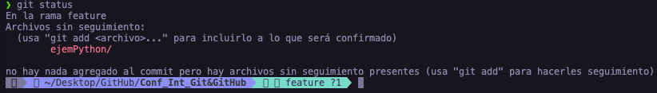
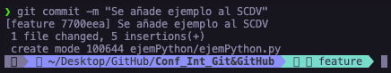
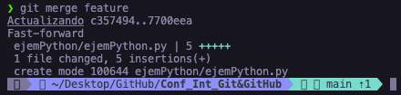
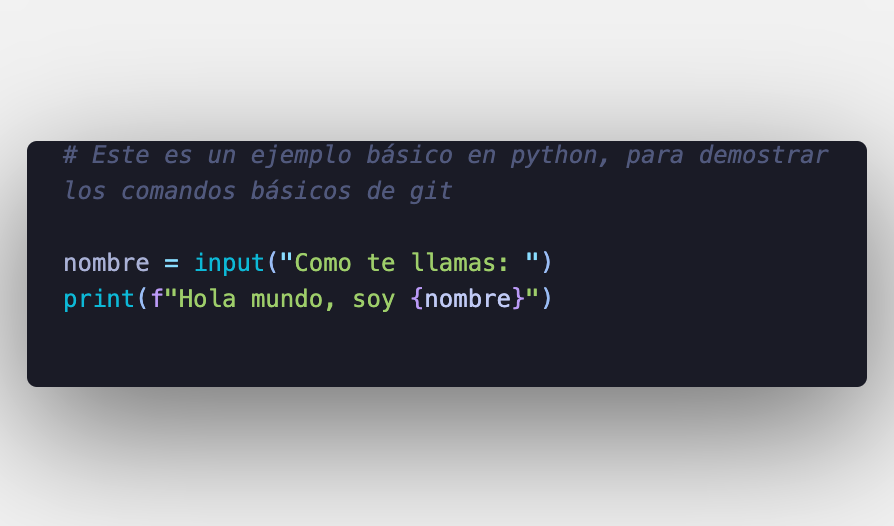

# Este es un ejemplo con python para utilizar los comandos básicos de git.
##### ***Nota: Se da por hecho que ya se tiene un proyecto con el SCDV iniciado***
##### ***-No hacer caso al nombre de la rama (branch)***

## Al crear un archivo en esta caso uno con extension .py, el pront cambia.

## ***Git Status:*** muestra el estado del directorio de trabajo y del área del entorno de ensayo. Permite ver los cambios que se han preparado, los que no y los archivos en los que Git no va a realizar el seguimiento

$ git status

## ***Git Add:*** Mueve los cambios del directorio de trabajo al área del entorno de ensayo. Así puedes preparar una instantánea antes de confirmar en el historial oficial (Al poner un " . " al final del comando agrega todos los archivos al entorno de ensayo).

$ git add .

## ***Git Commit:*** Captura una instantánea de los cambios preparados en ese momento del proyecto. Las instantáneas confirmadas pueden considerarse como versiones "seguras" de un proyecto

$ git commit -m "Mensaje descriptivo de los cambios o updates del proyecto"

## ***Git Merge:*** Permite tomar las líneas independientes de desarrollo creadas por git branch e integrarlas en una sola rama 

$ git merge feature

### ***Ejemplo en python***

